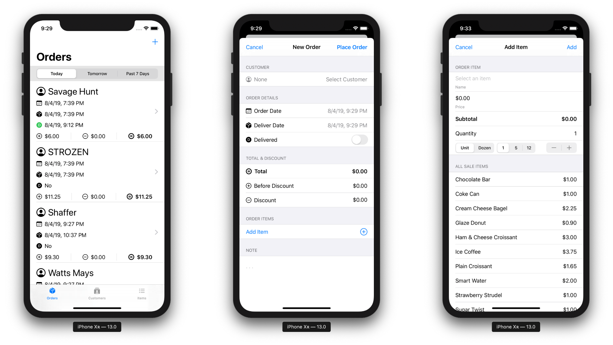
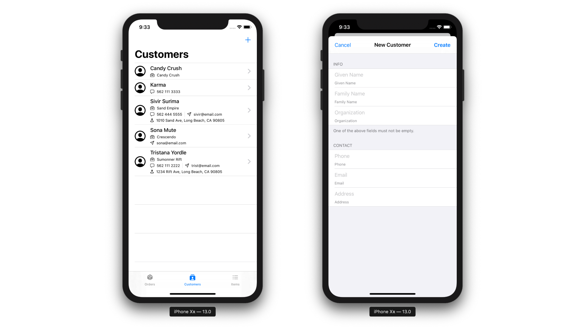
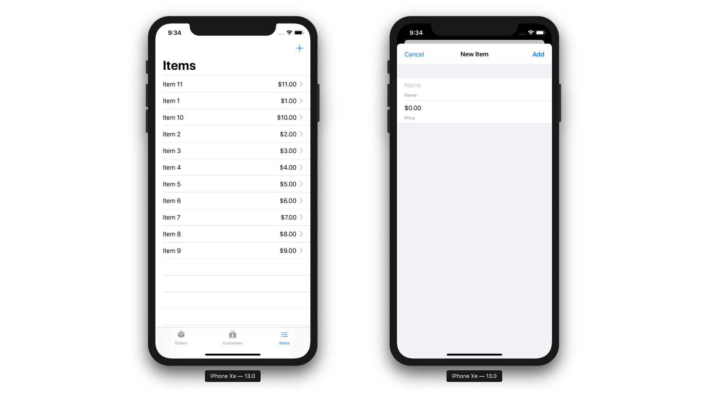

# ShoB

A project aimed to build an order tracking iOS application and also to learn SwiftUI.

## Status

In progress...

## Goal

- [ ] 100% SwiftUI
- [ ] Intergrage CoreData & iCloud AutoSync
- [ ] CloudKit Share Support
- [ ] Dark Mode Support
- [ ] Markdown Support
- [ ] Generate Invoice PDF
- [ ] Deploy

## Preview

### Order Scene

### Customer Scene

### Item Scene

## Learning

This is a section for documents, resources, thoughts, and approaches are explained.

### Core Data & iCloud Auto Sync

Since iOS 13 now support Core Data auto sync with iCloud, the project will take advantage of that.

**Requirement:**

- Creating the Core Data Stack, use `NSPersistentCloudKitContainer` instead of `NSPersistentContainer`.
- The auto sync feature requires that all properties of `NSManagedObject`'s Entity must be *optional* in the `.xcdatamodeld` file.

**Resource**:

- [Setting Up Core Data with CloudKit][Setting Up Core Data with CloudKit]
- [Creating a Core Data Model for CloudKit][Creating a Core Data Model for CloudKit]
- [Reading CloudKit Records for Core Data][Reading CloudKit Records for Core Data]
- [Syncing a Core Data Store with CloudKit][Syncing a Core Data Store with CloudKit]
- [Accessing Data When the Store Has Changed][Accessing Data When the Store Has Changed]
- [Consuming Relevant Store Changes][Consuming Relevant Store Changes]

### CloudKit Share

*Still on the list*.

### Dark Mode

To support dark mode out of the box, the project makes use of system colors such as `Color.primary`, `.secondary`, and `.accentColor`...

### Markdown

*Still on the list*.

### Generate PDF

*Still on the list*.

### View

#### Model View View Model (MVVM)

The MVVM is used on most of the top level views to handle view update. Whereas, some of the inner views or views that are part of the top level views might only need `@State` properties.

- Most top level views have their own view model either a `struct` or a `class` which conforms to `ObservableObject`.
- Property Wrapper `@Published` is used in the class view model to get will-change signal from the publisher for the properties of interest.

#### Navigation View Push/Pop

There is a feature in the application to discard any unsaved changes when user tap on the navigation view's back button.

Until there is a native way of doing this, the approach right now is to use [`NavigationStateHandler`][NavigationStateHandler] object to setup action to perform when the view is pushed or popped.

#### Create/Read/Update/Delete Core Data Object

The approach right now is the make use of `EnvironmentObject`. There will be a concrete data source object specific to each type of model object that will handle all the actions.

The concrete data source object will conform to [`DataSource`][DataSource] protocol. The protocol has all the methods for fetching, creating, reading, updating, deleting, and validating `NSManagedObject`.

Therefore, views that have access to the `EnvironmentObject` will be able to access objects and methods to perform necessary actions.

Current concrete classes conform to `DataSource`:

- [`OrderDataSource`][OrderDataSource]
- [`CustomerDataSource`][CustomerDataSource]
- [`SaleItemDataSource`][SaleItemDataSource]

<!-- MARK: - Link -->

[NavigationStateHandler]: https://github.com/iDara09/ShoB/blob/master/ShoB/Utility/NavigationStateHandler.swift

[DataSource]: https://github.com/iDara09/ShoB/blob/master/ShoB/DataSource/DataSource.swift

[CustomerDataSource]: https://github.com/iDara09/ShoB/blob/master/ShoB/DataSource/CustomerDataSource.swift

[OrderDataSource]: https://github.com/iDara09/ShoB/blob/master/ShoB/DataSource/OrderDataSource.swift

[SaleItemDataSource]: https://github.com/iDara09/ShoB/blob/master/ShoB/DataSource/SaleItemDataSource.swift

[Setting Up Core Data with CloudKit]: https://developer.apple.com/documentation/coredata/mirroring_a_core_data_store_with_cloudkit/setting_up_core_data_with_cloudkit

[Creating a Core Data Model for CloudKit]: https://developer.apple.com/documentation/coredata/mirroring_a_core_data_store_with_cloudkit/creating_a_core_data_model_for_cloudkit

[Reading CloudKit Records for Core Data]: https://developer.apple.com/documentation/coredata/mirroring_a_core_data_store_with_cloudkit/reading_cloudkit_records_for_core_data

[Syncing a Core Data Store with CloudKit]: https://developer.apple.com/documentation/coredata/mirroring_a_core_data_store_with_cloudkit/syncing_a_core_data_store_with_cloudkit

[Accessing Data When the Store Has Changed]: https://developer.apple.com/documentation/coredata/accessing_data_when_the_store_has_changed

[Consuming Relevant Store Changes]: https://developer.apple.com/documentation/coredata/consuming_relevant_store_changes
